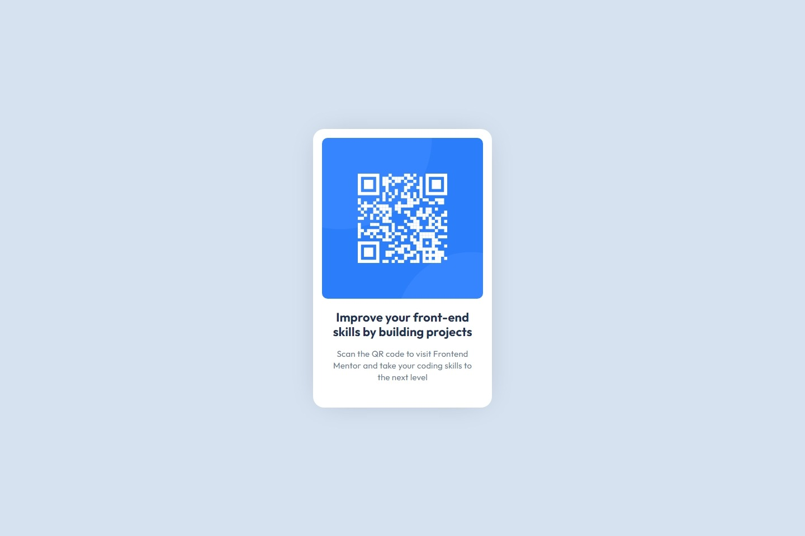

# Frontend Mentor - QR code component solution

This is a solution to the [QR code component challenge on Frontend Mentor](https://www.frontendmentor.io/challenges/qr-code-component-iux_sIO_H). Frontend Mentor challenges help you improve your coding skills by building realistic projects.

## Table of contents

- [Overview](#overview)
  - [Screenshot](#screenshot)
  - [Links](#links)
- [My process](#my-process)
  - [Built with](#built-with)
  - [What I learned](#what-i-learned)
  - [Continued development](#continued-development)
  - [Useful resources](#useful-resources)
- [Author](#author)
- [Acknowledgments](#acknowledgments)

## Overview

This site is designed to showcase a QR Code (linking to Frontend Mentor) as a Card.

### Screenshot




### Links

- Solution URL: [Solution on GitHub](https://github.com/horoserp/qr-code)
- Live Site URL: [Solution on Live Site](https://horoserp.github.io/qr-code)

## My process

### Built with

- [React](https://reactjs.org/) - JS library
- CSS

### What I learned

I reinforced my knowledge of React and CSS. I was also able to access the Figma files for this project, so it was a delight to return to and reacquaint myself with design files. Doing so helped me see subtle differences in my site and the design, such as text color, line height and letter spacing.

```css
p {
  color: var(--Slate500);
  line-height: 140%;
  letter-spacing: 0.2px;
  padding: 0px 16px;
}
```

### Continued development

I am planning on continuing my journey by exploring HTML, CSS, JavaScript and React more. I would love the opportunity to continue to use Figma files and create more for my own projects.

### Useful resources

- [W3Schools](https://www.w3schools.com/) - This is a great reference site which helped me remember some of the required syntax and css properties/values.
- [Stack Overflow](https://stackoverflow.com/) - This is an excellent resource for finding answers to precise questions. I used it once or twice during this challenge.

## Author

- Website - [Robert P. Horosewski](https://horoserp.github.io/React-Portfolio)
- Frontend Mentor - [@horoserp](https://www.frontendmentor.io/profile/horoserp)
- LinkedIn - [Robert P. Horosewski](https://www.linkedin.com/in/robert-horosewski-8a0608196/)

## Acknowledgments

Thanks to my wife for the encouragement to pursue my dream.
